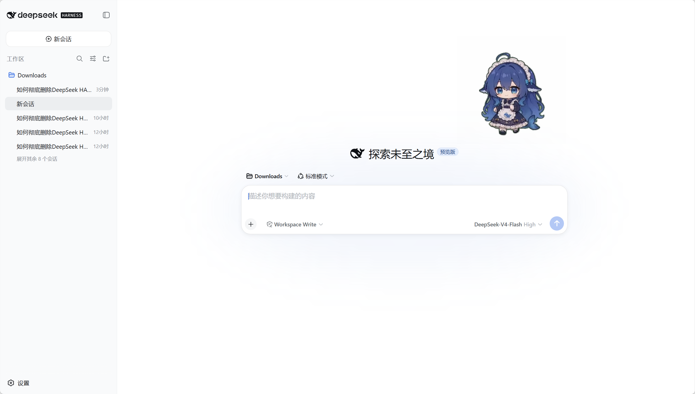
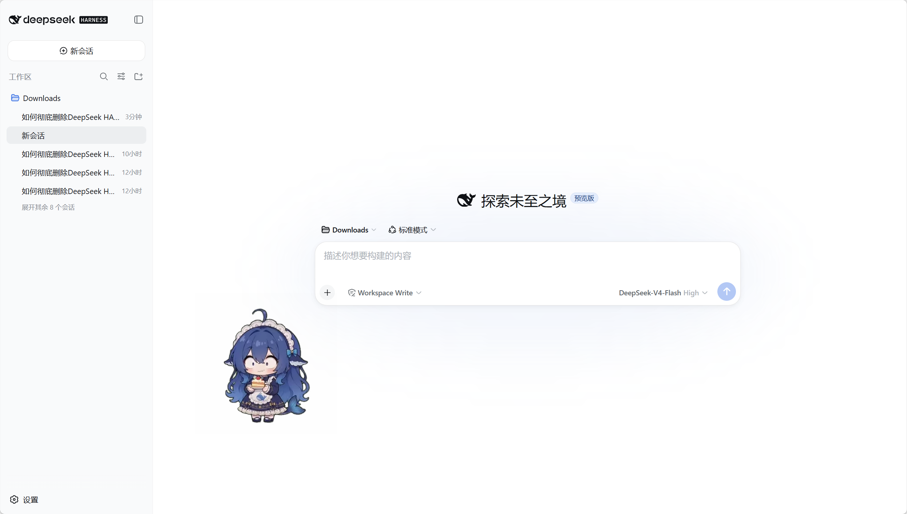

# dsh-pet 🐾

<p align="center">
  <a href="https://www.npmjs.com/package/dsh-pet"></a>
  <a href="https://www.npmjs.com/package/dsh-pet"></a>
  <a href="https://www.npmjs.com/package/dsh-pet"></a>
  <a href="https://github.com/PC2005-cloud/dsh-pet"></a>
  <a href="https://github.com/PC2005-cloud/dsh-pet/blob/main/LICENSE"></a>
  <a href="https://awesome-dsh-plugin.com"></a>
  <a href="https://github.com/PC2005-cloud/dsh-pet"></a>
  <a href="https://github.com/PC2005-cloud/dsh-pet/issues"></a>
  
  
</p>

一只住在 [DeepSeek Harness](https://github.com/deepseek-ai/deepseek-harness) 里的桌面宠物：待机呼吸、随机动作（打瞌睡、玩魔方、吃火锅……）、左右转向、屏幕漫游、点击 Q 弹、拖拽甩抛反弹、右键菜单点播——一百余个手绘风透明动画随时无缝衔接；还能跟随 DSH 会话事件切换工作状态动画、按档位播放余额动画 + 头顶气泡、碎碎念与对话聊天、窗口失焦时弹系统通知。可多开同屏，能脱离浏览器住上**桌面**（透明置顶小窗），也能自己添加**全新宠物种类**（pet pack）。

这不是一个普通插件，而是**完整的三件套项目**：

```
① 提示词（配方）    →  ② 素材生成链（引擎）  →  ③ 插件（成品）
AI 生成动画的配方     源视频 → 透明动画的管线    运行在 DSH 里的宠物
```

任何人 clone 本仓库，都可以**从零生成自己的桌面宠物**——换角色、换动作、换风格，全流程可复现。

---

## 快速开始（安装插件）

> 以下命令都在你的**命令行终端**（PowerShell / CMD 等）中运行。前提是 DSH 环境已就绪：

```sh
# ① 前置要求：确认 Node.js 已安装
node -v

# ② 安装 DSH 启动器与 pnpm（已装可跳过；装完请重新打开终端）
npm install -g @deepseek-ai/dsh pnpm
dsh --version   # 验证 dsh 命令可用

# ③ 安装本插件：--profile 填你实际在用的那个
#    桌面应用（Electron 版）→ desktop；dsh web → web
dsh plugin --profile desktop add dsh-pet
```

装完**重开桌面应用**（`dsh web` 用户则重启 `dsh web`）才生效——运行中的进程持有内存里的旧插件。宠物出现在界面右上角（默认配置角落，可在设置页修改）。

桌面应用也可以不开终端：直接在应用内「插件管理」的安装框里填 `dsh-pet`。

> **兼容性**：本插件当前在 dsh **`0.2.0-rc.2`** 下开发并测试（`dsh --version` 可查看你的版本）。建议使用相同版本；其他版本如遇问题欢迎反馈。

### 从源码安装（clone 本仓库后）

`lib/` 构建产物不入库，clone 后需要先构建再安装：

```sh
# ① clone 本仓库，进入插件目录
git clone https://github.com/PC2005-cloud/dsh-pet.git
cd dsh-pet/dsh-pet

# ② 安装依赖
npm install

# ③ 构建（完整 lib：tsdown → lib + 桌面共享核心 + 类型声明）
npm run build       # 必须手动跑一次（克隆后 npm install 不再自动构建）

# ④ 安装到 DSH（file: 指向**插件目录**——上面 cd 进去的那一层，用构建好的 lib）
#    --profile 同样填实际在用的：桌面应用 desktop、dsh web → web
dsh plugin --profile desktop add file:D:/path/to/dsh-pet/dsh-pet
```

> 注：`npm run build`（即 `scripts/prepare.js`）才产出**完整可安装**的 lib——除 tsdown 构建外还构建桌面共享核心（`shared-core.js`）、生成类型声明并收敛发布 `files` 清单；裸 `tsdown` 构建会缺桌面运行时与类型。发布与打包（`npm publish` / `npm pack`）时由 `prepack` 自动调用它，克隆仓库后需手动跑一次。

## 💬 反馈与发版节奏

欢迎提 [issue](https://github.com/PC2005-cloud/dsh-pet/issues) 与 PR——bug、体验问题、优化想法都行。但动手前请先翻一眼 [提交记录](https://github.com/PC2005-cloud/dsh-pet/commits/main)，确认不是已经修掉的同款问题（有些问题可能已经在 `main` 上修好了，只是还没发版）。

- **小修不单独发版**：不影响使用的小 bug 与优化会**累计**到下一个版本一起发，避免版本更迭过于频繁。所以「`main` 上已经修了」不等于「你装的这版已经包含」——`latest` 没更新时，以 `main` 的提交记录为准。
- **想立刻用上未发布的修复**：按上面的「从源码安装」把插件指向本地仓库即可；注意**宿主半侧**的代码改动要**重开 DSH** 才生效（浏览器半侧刷新页面即可）。
- **报 bug 时请带上**：插件版本、`dsh` 版本、操作系统、复现步骤（有日志或截图更好）。

## 插件功能

- **纯粹的桌宠**：不做天气、监控等无关功能，不碰 DSH 内核；可选能力只有下面这些（余额 / 单轮消耗 / 碎碎念 / 对话 / 工作状态 / 系统通知）
- **动画链**：每个动画（含待机）播完即按权重选下一个（默认 idle 10 / turn 5 / move 5 + 分类权重，`config.jsonc` 可调），首尾相接
- **事件动画**：余额 / 碎碎念 / 工作状态按档位触发专属动画；档位支持候选数组——触发时档内随机、循环播放自动轮换，避免连播同一段
- **多开**：同时显示多个宠物，各自独立大小与位置（设置页「桌宠配置」添加/删除）
- **屏幕漫游**：朝朝向方向行走，先探测空间、不走出屏幕（多屏按各屏边界判定）
- **点击 / 拖拽 / 甩抛**：点击有回应动画并 Q 弹挤压；拖拽过阻尼弹簧跟手，甩出即抛物线飞行、屏幕边缘反弹、落地摩擦停稳并 Q 弹一下；温柔放下原地停住；两端同一套纯函数物理与挤压曲线（`dsh-pet/src/shared/physics.ts`）
- **右键菜单**：「动作 → 分类 → 具体动画」任意点播（移动类动画点播会真实行走一段）；工具项——浏览器端：碎碎念 / 对话 / 回到初始位置；桌面端：+ 打开网站、查看余额（余额启用时显示）、重载配置（改完配置文件直接右键重载全部桌面宠物，不必回设置页点保存）
- **朝向与落地**：全部动画可镜像（可朝左 / 朝右）；脚底线统一，宠物始终站在地面上
- **流畅切换**：双缓冲交叉淡入，切换无空白帧
- **余额展示**：按已用百分比分档播余额动画 + 头顶联想气泡（10 秒自动消失）；DeepSeek 显示账户余额，OpenCode Zen Go 与 Command Code 显示最紧迫的一个额度窗口；**未登记余额接口的服务商改为弹文字说明**（不静默）；按宠物独立开关
- **每轮消耗估算**：DeepSeek 官方对话完成后弹出桌宠侧面的独立白色半透明气泡（5 秒自动消失，靠屏边自动换侧）；Web 设置提供勾选开关（目前仅支持 DeepSeek 官方 API）及 **CNY / USD** 选择，保存后网页与桌面同步使用对应官方单价
- **碎碎念与对话**：碎碎念按周期自动生成一句（说话动画 + 气泡，也可手动触发）；对话在右键弹输入框与宠物聊天，记忆持久化（浏览器 / 桌面共享同一份）
- **工作状态联动**：监听 DSH 会话事件，切「思考 / 工作 / 整理 / 等待 / 成功 / 出错」档位动画 + 常驻气泡；目标多轮任务只在真正收尾轮庆祝
- **系统通知**：窗口失焦时弹系统 toast（对话完成 / 生成失败 / 输出截断 / 权限申请 / 用户选择）
- **桌面模式（可选）**：每只宠物开一个独立透明置顶局部小窗，与浏览器严格同行为、共用同一份素材与纯逻辑（见下节）
- **pet pack（额外宠物种类）**：`pet/` 下建 `种类名-config.json` + `种类名-animation/` 即新增独立动画池与素材的全新种类，多实例共享素材（见「配置 → 方式四」）
- **自定义动画**：往 `main-animation/webm/` 放 VP9-Alpha 的 `.webm` 即为新动画，优先于包内素材
- **无障碍**：支持 `prefers-reduced-motion`（减少动效时跳过 Q 弹挤压与淡入切换）

## 🔌 对外接口（供其他插件调用）

桌宠不只自己玩，也**对外开放一套 HTTP 接口**，让别的插件或脚本能驱动它、读它的状态。

- **能做什么**：让它说一句指定的话、播一段指定动画、与它对话；读它当前说的话、工作状态、系统通知与余额
- **为什么开放**：桌宠不该只是个摆设——比如一个「女仆」插件巡检验完想说句话，就能让桌宠当它的「实体」开口；也方便任何人基于它做二次开发
- **怎么调**：挂在 DSH 自己的 Web 服务上（前缀 `/dsh-pet-7340`，只监听本机、无鉴权）。动作类接口只回 `{ok}`，数据统一从 `GET /state` 读

三个相关文件：

- [`API.md`](API.md) —— 接口一览（每个接口一句话，功能预览）
- [`openapi.yaml`](openapi.yaml) —— 完整契约（OpenAPI 3.1，可直接导入 Swagger UI / Postman）
- [`tools/api-tester.html`](tools/api-tester.html) —— 桌宠控制台：扮演第三方消费方的示例页面，可直观试用（`node tools/api-tester.cjs` 启动）

## 兼容性

- **操作系统**：Windows / Linux / macOS 三端均可运行——浏览器 overlay 与桌面模式（Electron 透明置顶窗）行为完全一致；Electron 按平台自动探测/下载（`electron.exe` / `Electron.app` / linux 单文件），无需手动安装
- **无头 / 无桌面环境**：支持 Linux headless 等无图形会话——桌面模式自动检测显示环境（Linux 无 `DISPLAY` / `WAYLAND_DISPLAY` 时判定无显示、跳过桌面窗口，仅日志告警），浏览器 overlay 不受影响
- **浏览器**：浏览器 overlay 兼容 **Chromium 内核（Chrome / Edge 等）与 Firefox**——透明动画依赖 VP9-Alpha webm，三者均已实测透明确认；**不支持 Safari**（macOS 不认 webm alpha，透明渲染为黑底）——macOS 用 `.mov` 素材（GitHub Release `assets-mov`），下载放入 + 改 `ANIMATION_EXT` 变量即可（见「②.5 Safari/HEVC 兼容素材」）
- **多显示器**：支持多屏环境——跨屏漫游/抛掷以各屏工作区为界，异构缩放（各屏 DPI 不同）、任务栏条带、屏幕之间空洞均正确判定（横屏 / 竖屏 / 上下叠放皆可）

## 🪟 桌面模式（可选，脱离浏览器）

插件内建**双模式**：安装后默认会拉起**独立透明置顶小窗**——为每只桌面宠物各开一个局部窗口（跟随宠物移动，**不铺满屏幕**），与浏览器 overlay 严格同行为、功能完全对齐：

- **依赖**：首次启动自动探测/下载 Electron（`~/.dsh/electron/`，也可 `cd dsh-pet && npm run ensure:electron` 手动触发）；缺失时仅日志告警，不影响浏览器形态
- **开关 = 每只宠物的必填字段 `display`**：`web` = 仅浏览器 / `desktop` = 仅桌面 / `both` = 两者 / `none` = 都不显示；桌面模式渲染 display 含 desktop 的**全部**宠物（多开同屏，与浏览器一致），设置页「桌宠配置」编辑即时生效
- 桌面端数据走独立进程管道，不依赖 DSH 的 HTTP 路由，不受 web 访问闸门影响
- 本地调试：`cd dsh-pet && npm run start:desktop -- http://127.0.0.1:3080/dsh-pet-7340/config`（无宿主时自动回落 HTTP 路径）

## 🧍 独立运行（完全不打开 DSH）

连 DSH 都不用开：插件的宿主半边跑在伪 ctx 上，由一个本机 HTTP 服务接管路由（**路由表仍是插件那一份**）。

```sh
npm install -g dsh-pet        # 必须 npm 装；dsh plugin add 装进 profile，bin 不在 PATH 上
dsh-pet-standalone            # http://127.0.0.1:3080/dsh-pet-7340/（占用则顺延）
dsh-pet-standalone --check    # 只体检
dsh-pet-standalone --port 3100

npm run build && npm run standalone   # 仓库里（先构建）
```

- **能用**：动画链、点击/拖拽/甩抛、右键菜单、多开、自定义动画与表情包、pet pack。
- **不可用**：余额、碎碎念、对话、系统通知——返回带 `reason` 的结构化失败（见 [`API.md`](API.md)）。
- **配置**：与 DSH 同一份（`$DSH_HOME/dsh-pet/main-config.jsonc` → 包内默认）。
- **只显示 `display` 含 `desktop`/`both` 的实例**；端口默认 3080；`Ctrl+C` 或 `POST /shutdown` 退出。
- **与 DSH 内运行可同时开**，但共用 `%APPDATA%\dsh-pet-electron-helper`，可能互相踩缓存（仅告警）。

## ⚙️ 余额展示（Balance）

按 `eventsRefreshSec.balance`（秒）周期拉取当前服务商的余额/用量数据，每次刷新按档位触发一次余额动画，并在宠物头顶弹出**联想气泡**（随宠物大小等比缩放，10 秒自动消失）：

- **DeepSeek 官方（`deepseek-official`）**：气泡显示账户余额（如 `余额 ¥8.79`）；余额按 ¥20 满额折算成已用百分比，分 6 档播放动画（钱袋满溢 → 金袋叮当 → 钱袋如常 → 数金皱眉 → 袋空如洗 → 分文不剩）
- **OpenCode Zen Go（`opencode-go`）**：气泡显示 5h/周/月 三个额度窗口中最先告急的一个（如 `周额度已用 88%` / `2.5 天重置`），同样按已用百分比分档
- **Command Code（`commandcode`，含 GOAT 等套餐）**：气泡显示 5h/周/月 三个额度窗口中最先告急的一个（与 opencode 同一口径：剩余额度最少者，通常先报 5h）；套餐无窗口限制时只报月度窗
- **暂不支持的服务商**：未登记余额接口的服务商**不播档位动画，改为弹一句文字说明**——第一行「当前服务商暂不支持余额查询」，第二行报出当前 provider id（便于自查）；缺凭证 / 抓取失败同理（原因写在第二行）。自动轮询只在**原因变化**时弹一次（不反复打扰），手动 `/balance` 或桌面右键「查看余额」则每次都会弹
- **本轮消耗提示**：Web 设置中的「本轮消耗（估算）（目前仅支持 DeepSeek 官方 API）」提供独立总开关；关闭不影响账户余额，提示仍由第一只启用余额的可见宠物承载
- **按宠物开关**：`pets[i].balanceEnabled`（必填布尔）控制该宠物是否触发余额动画/显示气泡
- **所需凭据**：对应 provider 的 API key（`deepseek-official` → `DEEPSEEK_API_KEY`；`opencode-go` → `OPENCODE_GO_API_KEY`；`commandcode` → `COMMANDCODE_API_KEY`），在 DSH 凭据中配置后启用；未匹配的服务商不触发动画，改为弹上面的文字说明气泡

## ⚙️ 每轮对话消耗提示

- **功能开关**：Web 设置 →「桌宠配置」勾选「本轮消耗（估算）（目前仅支持 DeepSeek 官方 API）」后保存，网页与桌面同步生效；默认开启，旧配置无需迁移。关闭后在下次轮询收起费用气泡，重新开启不补播旧提示；关闭时币种选择禁用但保留原值。此开关独立控制费用提示，不影响账户余额展示；仍由第一只启用余额的可见宠物承载气泡
- **本轮消耗（估算）**：每轮 DSH 对话正常结束后，以桌宠侧面的独立白色半透明气泡显示 `本轮消耗（估算） / CNY x.xxxx` 或 `USD x.xxxx`；持续 **5 秒**，鼠标移到桌宠上立即收起。每端仅第一只启用余额的可见宠物显示；网页按当前会话隔离，桌面跟随最近开始的会话，切换网页会话或刷新不会重放旧提示
- **估算币种**：Web 设置 →「桌宠配置」→「本轮消耗（估算）币种」选择 **CNY（人民币）/ USD（美元）**后保存（默认 CNY）。CNY 使用[官网中文人民币价](https://api-docs.deepseek.com/zh-cn/quick_start/pricing/)，USD 使用[官网英文美元价](https://api-docs.deepseek.com/quick_start/pricing/)；切换时整轮按对应价格结果展示，**不按汇率换算、不只替换货币标签**。设置同时作用于网页和桌面，账户余额仍显示接口返回的原币种
- **估算口径**：累计本轮全部调用的未缓存输入、缓存写入、缓存命中和输出 token，按实际模型及各次请求开始时的峰谷价计算；高峰为北京时间周一至周五（不含中国节假日）09:00–12:00、14:00–18:00，其余半价。价格和节假日每次启动时更新，运行期间每 **6 小时**刷新；抓取失败保留最近有效缓存或已知内置数据；未知模型、其他服务商、缺失用量或异常中断不展示不完整金额，最终费用以官方账单为准
- **配置与设置**：开关保存在 `$DSH_HOME/dsh-pet/main-config.jsonc` 顶层 `spendEnabled`（布尔，默认 `true`），币种保存在 `$DSH_HOME/dsh-pet/main-config.jsonc` 顶层 `spendCurrency`（`"CNY"` / `"USD"`）；默认配置在 `dsh-pet/assets/config.jsonc`，Web 设置入口在 `dsh-pet/src/client/settings.ts`，保存校验在 `dsh-pet/src/host/config.ts`
- **价格与计费**：`dsh-pet/src/host/pricing-catalog.ts` 分别维护中英文官方价格，内置快照核对于 **2026-09-28**；`dsh-pet/src/host/turn-spend.ts` 按会话与回合累计双币种金额，Flash 旧别名使用现行 Flash 价，Pro 独立计价
- **启动更新与缓存**：每次加载插件都立即重新请求 DeepSeek 中英文官网价格及北京时间当年、次年的节假日数据，不因已有缓存跳过更新；运行期间每 **6 小时**再次更新。`dsh-pet/src/host/holidays.ts` 使用 [holiday-cn](https://github.com/NateScarlet/holiday-cn) 整理的国务院公告日历（第三方数据源，保留公告来源链接），自动处理跨年；`dsh-pet/src/host/startup-data.ts` 将校验通过的结果保存到 `$DSH_HOME/dsh-pet/cache/pricing.json`、`holidays.json`。网络失败保留最近有效缓存，首次离线可用内置价格与 2026 年日历；未取得其他年份的日历时，不猜测工作日高峰费用
- **侧面避让**：费用气泡优先显示在桌宠右侧，右侧空间不足时自动切换到左侧，避开头顶的任务完成提示；显示期间跟随位置更新，桌面模式按宠物所在显示器工作区和窗口的交集判断边缘，保留余额气泡的背景、颜色和字体
- **统一状态接入**：两端沿用新版每秒一次的 `/state` 轮询：网页传 `sessionId`，桌面传 `desktop=1`，从 `sections.turnSpend.data` 接收当前会话的估算结果；不新增每只宠物的费用轮询。普通不带参数的 `/state` 保持原有结构；独立模式没有 DSH 会话事件时不显示费用气泡
- **两端展示**：`dsh-pet/src/shared/turn-spend.ts` 共用气泡样式与统一状态订阅；币种保存后下次轮询更新尚未消失的金额，不重放旧气泡、不延长显示时长
- **诊断与安装**：`/dsh-pet-7340/turn-spend/debug` 返回当前币种、价格来源，以及价格/节假日的最后尝试时间、成功更新时间、失败原因和今日节假日判定，不返回会话 ID 或聊天内容。首次启动刷新完成前到达的事件延后结算；源码修改后执行 `npm run build`，重新安装本地插件并重启 DSH

## ⚙️ 碎碎念与对话

- **碎碎念**：`pets[i].whisperEnabled` 开启后，按 `eventsRefreshSec.whisper`（秒，默认 300）周期自动生成一句——每只宠物独立周期、独立文案；触发时随机抽 `events.whisper` 动画 + 头顶说话气泡（10 秒消失）。默认开启
- **手动触发**：右键菜单「碎碎念」随时来一句——不受 `whisperEnabled` 门控（该字段只关自动周期轮询）
- **对话**：右键菜单「对话」或 `/chat` 命令打开输入框，与宠物聊天——回复走碎碎念同款展示（说话动画 + 气泡）；记忆持久化在 `$DSH_HOME/dsh-pet/memory.json`，浏览器与桌面共享同一份；多宠物时先用 `/pet` 选择对话目标

## ⚙️ 工作状态联动（Work Status）

`pets[i].workStatusEnabled` 开启后，宠物跟随 DSH 会话活动切「思考 / 工作 / 整理 / 等待 / 成功 / 出错」六档动画 + 头顶气泡：非终态动画循环播、气泡常驻；成功 / 出错播一遍、气泡 10 秒自动收起。

- **档位动画**：`animations.events.workStatus` 数组，索引即档位（勿在中间插入新档，只可追加末尾）
- **气泡文案**：`workStatusTexts` 每档可配多句随机，任务详情（todo）优先
- **档位候选数组**：任意档位槽位可写 `string | string[]`——数组 = 档内随机抽 1，循环播放自动轮换、避免连播同一段（余额 / 碎碎念档位同样适用）

## ⚙️ 配置（大小 / 位置 / 多开）

桌宠的大小、位置、多开均可配置，两条途径：

> 💡 **两条途径只是编辑入口不同，最终都是同一份用户配置**——配置能力远不止设置页那几个选项：设置页可改大小/位置/边距/显示位置/余额开关/多开，但**手动编写配置文件可以任意自由配置**（动画池、播放权重、事件动画、刷新周期……），只要**格式与包内默认配置 `config.jsonc` 一致**即可，用户配置会**整体覆盖**对应字段的默认值。

### 方式一：设置页（推荐）

DSH 设置 → 「桌宠配置」：

- **大小**：宽度 px（高度自动 = 宽度 × 9/16）
- **位置**：四角（corner）＋ 水平/垂直边距（marginX / marginY）
- **显示位置**（display）：web=仅浏览器 / desktop=仅桌面 / both=两者都显示 / none=都不显示
- **余额功能**：勾选后该宠物才会触发余额动画并显示余额气泡（服务商未登记余额接口时改为弹文字说明气泡）
- **多开**：添加/删除宠物，每只宠物独立 id、大小、位置
- **物理参数**：拖拽抛掷手感（重力 / 弹性 / 地面摩擦 / 总力度 / 顶部反弹 / 宠物互撞）也能在设置页图形化改，不用去手改配置文件
- **AI 模型**：碎碎念与对话可以**各自指定模型**——设置页「AI 模型」每项一个下拉框（与 DSH 对话框右下角的模型选择器同款：搜索框 + 按服务商分组的清单，选项同源）；选「跟随当前对话」= 用当前对话的模型，指定了但调用失败会自动回落到当前对话的模型重试一次
- 点「保存」**即时生效**（无需刷新）；「同步」把包内 `config.jsonc` 的**原文**（含注释与全部高级字段）整份写入用户配置——既回到默认，又留下一份可直接编辑的完整配置

### 方式二：config.jsonc（单一来源）

插件包内 `dsh-pet/assets/config.jsonc` 的 `pets` 数组定义**默认宠物**：

```jsonc
"pets": [
  { "id": "main", "size": 462, "balanceEnabled": true, "display": "both", "position": { "corner": "top-right", "marginX": 24, "marginY": 100 } }
]
```

- 每只宠物：`id`（标识）／ `size`（宽度 px）／ `balanceEnabled`（是否启用余额功能，必填布尔）／ `display`（web/desktop/both/none，必填，见上）／ `position`（corner 四角之一 + marginX/marginY 边距）
- 余额刷新周期：`eventsRefreshSec.balance`（秒）——余额数据刷新与余额动画触发的间隔，启动时立即触发一次，之后按此周期循环（默认 1800）
- 设置页的修改保存到用户层 `$DSH_HOME/dsh-pet/main-config.jsonc`（**完整宠物列表**，覆盖包内默认）；「同步」把包内 `config.jsonc` 原文整份写入该文件（等价于回落默认，但文件保留下来、可直接编辑）

### 方式三：手动编辑配置文件（高级，任意自由配置）

用户层配置文件位于 `$DSH_HOME/dsh-pet/main-config.jsonc`。**它和包内默认配置是同一套格式**——想改什么直接照着 `assets/config.jsonc` 的结构写即可，写错的字段/缺失的字段回落默认，无需（也无法）写完整份。设置页「同步」可直接生成这份完整文件（原文复制包内 `config.jsonc`，注释齐全）：

| 字段                   | 作用                                                                                    | 格式与默认一致即可         |
| ---------------------- | --------------------------------------------------------------------------------------- | -------------------------- |
| `pets`                 | 宠物列表（大小/位置/多开/余额开关）                                                     | 数组，每项同 `pets[]` 结构 |
| `animations`           | **动画池**：idle / turn / drag / clicks / moves / categories / events（余额等事件动画） | 同 `animations` 结构       |
| `animationWeights`     | 动画链播放权重（idle / turn / move）                                                    | 同 `animationWeights` 结构 |
| `eventsRefreshSec`     | 事件刷新周期（秒）                                                                      | 同 `eventsRefreshSec` 结构 |
| `notificationsEnabled` | 系统通知总开关（布尔）                                                                  | 同 `notificationsEnabled`  |

> 覆盖语义：用户层给出即**整体替换**该字段（如写了 `animations` 就用你的整份动画池，替代默认），没写的字段回落包内默认。校验在插件加载时执行——格式错误会在 DSH 控制台显式报错，不会静默运行残缺配置。

### 方式四：额外宠物（pet pack）——添加新「种类」

方式一~三都只调整**默认宠物的实例**（数量/大小/位置），动画池始终是全局一份。要添加**全新种类的宠物**（独立动画池 + 自己的素材），在用户数据根下建 `pet/` 目录：

```
$DSH_HOME/dsh-pet/
├─ main-config.jsonc           ← 主宠物配置（现有，不动）
├─ main-animation/webm/*.webm  ← 主宠物素材（现有，只属于 main）
└─ pet/
   ├─ pig-config.json          ← 额外宠物 pig 的配置（命名词干 = 种类名，实例 id 任意）
   └─ pig-animation/*.webm     ← pig 自己的动画素材（直接平铺，仿 main-animation）
```

每只额外宠物 = 一个 `-config.json` + 一个 `-animation/` 目录，同前缀配对；扫描 `pet/` 自动发现，浏览器与桌面同时生效。一个 `-config.json` 定义**一个「种类」**（动画池 + 素材目录），`pets` 数组可放该种类的**任意多只实例**（共享动画池与素材）：

```jsonc
// pet/pig-config.json —— 与 main-config.jsonc 同构的完整配置
{
  "notificationsEnabled": true,
  "pets": [
    {
      "id": "pig1",              // 实例 id（可多只；不必等于文件名前缀）
      "size": 420,
      "balanceEnabled": true,
      "display": "both",        // web / desktop / both / none
      "position": { "corner": "top-right", "marginX": 24, "marginY": 100 }
    },
    { "id": "pig2", "size": 360, "balanceEnabled": false, "display": "web", "position": { "corner": "top-left", "marginX": 24, "marginY": 100 } }
  ],
  "animations": {
    "idle": ["待机"], "turn": [], "drag": [], "clicks": ["打滚"],
    "moves": { "default": { "minDist": 80, "maxDist": 360, "margin": 20, "leadSec": 2, "tailSec": 2 }, "actions": [] },
    "categories": [],
    "events": { "balance": ["余额-钱袋满溢", "余额-金袋叮当", "余额-钱袋如常", "余额-数金皱眉", "余额-袋空如洗", "余额-分文不剩"] }
  },
  "animationWeights": { "idle": 80, "turn": 0, "move": 0 },
  "eventsRefreshSec": { "balance": 1800 }
}
```

规则（与主宠物**严格隔离**，绝不混用）：
- **素材只查自己的**：素材目录名 = 文件名前缀（`pet/pig-config.json` → `pet/pig-animation/`），该种类所有实例共用；动画 URL `/thumb/<前缀>/<名>.webm`，查不到即 404——绝不落到 `main-animation` 或包内素材
- **动画池不回落全局**：`animations` / `animationWeights` 必须写全（缺失即配置错误）
- 与主配置同构的约束：`pets` 每只字段完整合法、数组内 id 唯一、`animations` / `animationWeights` 结构校验同一套规则；`notificationsEnabled` / `eventsRefreshSec` 是全局属性，不归宠物文件管（写了忽略、不写不报错）
- 配置非法 / 缺少 `-animation/` 目录 / 实例 id 与主宠物冲突 → 加载时显式报错并跳过（不影响其他宠物）
- 设置页不列出文件宠物（改文件即生效，刷新可见；保存/同步不会把它们写进 `main-config.jsonc`）
- 余额档位动画按各宠物自己的 `events.balance`

## 运行效果

宠物实际运行在 DSH Web 界面中的样子：

<p>
  
  
  
  
  
  
  
  
</p>

## 效果预览

全部动画（640×360，插件实际播放用的资源）——GIF 预览存放于仓库 `dsh-pet/assets/preview/`（raw 直链渲染，文件名采用拼音便于跨平台）；完整透明视频见插件包 `dsh-pet/assets/webm/`（VP9-alpha，唯一发布格式）：

**待机 / 转向**

<p>
  
  
</p>

**移动**

<p>
  
  
  
</p>

**小动作**

<p>
  
  
  
  
  
  
  
  
  
  
  
  
  
  
  
  
  
  
</p>

**玩耍**

<p>
  
  
  
  
  
  
  
  
  
  
  
  
  
  
  
  
  
  
  
  
  
  
  
  
  
  
  
</p>

**吃什么**

<p>
  
  
  
  
  
  
  
  
  
  
  
  
</p>

**时节**

<p>
  
  
  
  
  
  
  
  
  
  
  
  
  
  
  
  
  
  
  
  
  
</p>

**文字**

<p>
  
  
</p>

**点击回应**

<p>
  
  
  
  
  
</p>

**拖拽**

<p>
  
</p>

**余额事件**（按余额已用百分比分档，满格 → 告急 → 耗尽）

<p>
  
  
  
  
  
  
</p>

**碎碎念说话动画**（碎碎念 / 对话回复触发，随机抽 1 段）

<p>
  
  
  
</p>

**工作状态动画**（跟随 DSH 会话事件，六档：思考 / 工作 / 整理 / 等待 / 成功 / 出错）

<p>
  
  
  
  
  
  
</p>

> 注：动画为透明背景；GIF 预览中透明部分显示为页面底色，实际 webm 播放为透明。

## 从零生成你自己的宠物（完整流程）

### ① 提示词 → 源视频

用 AI 视频生成工具（如可灵、Runway、豆包等，本项目素材即由豆包生成），按 `prompts/桌面宠物 10 秒动作提示词.md` 的配方，一个动作生成一段 10 秒绿幕视频：

- 视频比例 16:9，背景纯绿幕（#00FF00）
- 人物位置/大小固定（头顶 ~20% 高度、脚底 ~85% 高度）
- 动作全程在画幅内，首尾帧为标准正面站立
- 每段动画按秒分解（0-10s 各阶段动作）

生成结果按动作各存一个 mp4，放入 `video/`。

> **源视频获取**：为控制仓库体积，`video/` 源视频不入 git。Releases 提供**打包压缩包**，浏览器直接下载即可：
>
> - `assets-videos.zip` —— 全部源视频压缩包（中文名 mp4，解压后放入 `video/`）
>
> 解压：`Expand-Archive assets-videos.zip`（Windows）或 `unzip assets-videos.zip`，把 mp4 放回 `video/` 即可运行素材链。

### ② 源视频 → 透明动画（素材链）

step02（透明视频）有**两条路线，按需二选一**（默认自动、人人可复现；效果不佳可用 PR 手工抠像覆盖）：

```sh
cd scripts
# 路线 A（默认）：自动绿幕抠像（HSV 色相，无需人工）
python watermark_step01.py   # 水印遮罩填充 → step01/
python chroma_step02.py      # 绿幕抠像转透明 → step02/

# 路线 B（可选）：PR 手工抠像覆盖（针对含第三方物品/自动抠像效果不佳的动作）
#   1. 在 PR 里手工抠像，导出带 alpha 的透明 .mov（如 ProRes 4444 with Alpha）
#   2. 放入 pr/，文件名与动作名一致（如 吃白饭.mov）
python pr_import_step02.py   # pr/*.mov → step02/（透明 webm，覆盖该动作自动抠像结果）

# 后续步骤两条路线共用：
python normalize_step03.py   # 归一化 2160×1215 统一站立居中 → step03/
python encode_thumbs.py      # 转码 640×360 播放变体 → step04/
```

**依赖**：Python 3 + ffmpeg + numpy + scipy（素材链脚本自动用工作区 `.tools/` 下的 ffmpeg）。

> **本项目全部采用路线 B**（全部动作均为 PR 手工抠像）：对"含第三方物品/透明边缘复杂"的动作，自动 HSV 抠像易残边或误抠，PR 手动遮罩更精细。两条路线产出同一级 `step02/`，后续步骤完全一致；`chroma_step02.py` 保留为自动化兜底，任何动作仍可一键自动生成。

### ②.5 🍎 Safari/HEVC 兼容素材（macOS 专用 mov）

插件默认只发布 `.webm`（VP9-alpha），Safari/WKWebView 不认 webm alpha（黑底），macOS 需要在 GitHub Release 下载官方转码的 **HEVC-with-Alpha `.mov`** 素材使用，三步：

1. **下载**：<https://github.com/PC2005-cloud/dsh-pet/releases/tag/assets-mov>（固定 tag，保持最新；zip 解压后文件名与 webm 一一对应）
2. **放入**：`.mov` 文件放进 `$DSH_HOME/dsh-pet/main-animation/mov/`（pet pack 宠物则是 `pet/<种类名>-animation/mov/`）
3. **改变量**：搜 `ANIMATION_EXT`，把 `.webm` 改为 `.mov`——npm 包改产物 `lib/client.js`（桌面端如需再改 `runtime/electron-helper/shared-core.js`）；自构建改源码 `src/shared/constants.ts` 后重新构建

宿主路由已固定双扩展名兜底（白名单 `webm|mov`、MIME、素材根按扩展名分派），无需改宿主。详情见插件 README「macOS 使用 mov」。

### ③ 动画 → 插件

```sh
# 把 step04 的播放变体同步进插件包（webm 直接 cp）
cp step04/*.webm dsh-pet/assets/webm/   # 播放格式（VP9-alpha）

# 本地安装插件（--profile 填实际在用的：桌面应用 desktop、dsh web → web；
# file: 指向插件目录 dsh-pet/dsh-pet）
dsh plugin --profile desktop add file:D:/path/to/dsh-pet/dsh-pet
```

> 中间产物（step01-04）由脚本生成、不入仓库；`video/` 源视频和脚本是成果、入库维护。

### 🎯 发布（单一 webm 格式）

插件只发布一个 npm 包、一个素材格式（webm）；`files` 收敛为固定清单（lib / src / assets/webm / runtime/electron-helper / assets/fonts / assets/pic / assets/config.jsonc / scripts/ensure-electron.mjs / cordis.patch.yml，见 `prepare.js`；浏览器与桌面模式共用，包体最小）：

```sh
cd dsh-pet
npm publish --tag latest   # prepack 自动执行构建（完整产物 + 收敛 files），无需手动构建
```

- client 端不做运行时浏览器判断——唯一播放格式 webm 在源码写死，无发布期注入
- 需要 Safari/HEVC 版（macOS）：mov 素材官方发布在 GitHub Release `assets-mov`，下载解压进 `main-animation/mov/`，再把集中播放扩展名常量 `ANIMATION_EXT` 改为 `.mov`（见上方 ②.5）

### 项目结构

三件套按 ①②③ 分块（gitignore 的本地目录不列）：

```
├── prompts/           # ① 动画生成提示词配方（绿幕规范 + 按秒分解）
├── video/             # ② 素材源视频（绿幕 mp4；不入库，Releases 提供压缩包）
├── scripts/           # ② 素材生成链（Python/ffmpeg：水印 → 抠像 → 归一化 → 转码 → GIF 预览）
├── step01~04/         # ② 素材链中间产物（不入库）
├── pr/  prproj/       # ② 路线 B：PR 手工抠像输入与工程（本地工作数据，不入库）
├── tools/             # 开发小工具（素材链各阶段预览等）
├── assets/            # 仓库展示用截图
├── .github/workflows/ # CI：Safari/HEVC 转码流水线（macOS runner，手动触发 → 发布 assets-mov Release）
├── dsh-pet/           # ③ 插件（可独立 npm 发布）
│   ├── src/           #   TS 源码：host（配置/路由/工作状态）、client（动画链）、shared（双端共用纯逻辑）
│   ├── lib/           #   构建产物（npm run build 生成，不入库）
│   ├── runtime/       #   桌面模式运行壳（Electron 透明窗）
│   ├── assets/        #   webm 动画 / preview GIF / 字体 / 图标 / config.jsonc 默认配置
│   └── scripts/       #   构建与发布脚本（prepare.js / prepack-check / ensure-electron 等）
└── LICENSE            # MIT
```

## 许可

- 代码：MIT
- 素材（动画/提示词/源视频）：允许开源使用，**禁止商用**
- **二次创作（二创）约定**：基于本项目的衍生 / 改版 / 换皮作品，在**任何介绍、展示、分发该作品的地方**，须附上原作者 GitHub 地址：<https://github.com/PC2005-cloud/dsh-pet>
